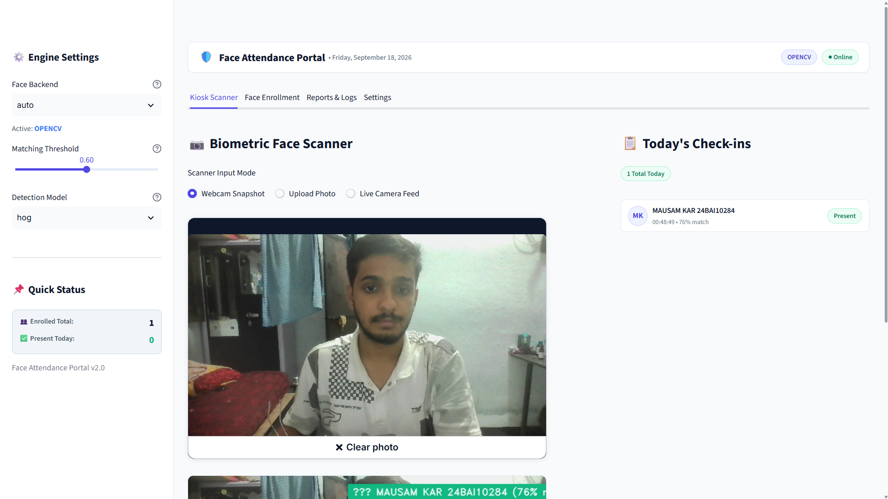
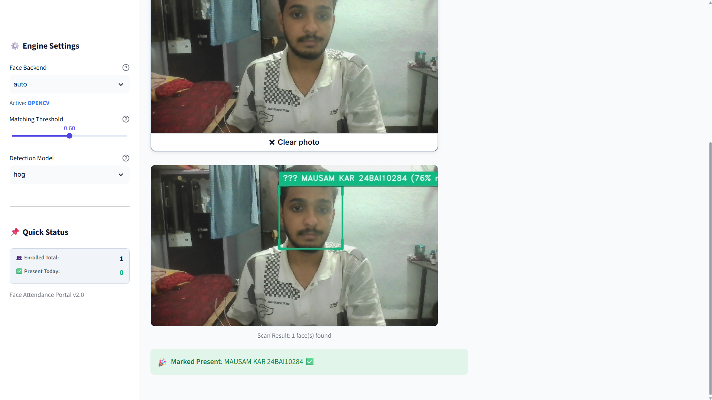
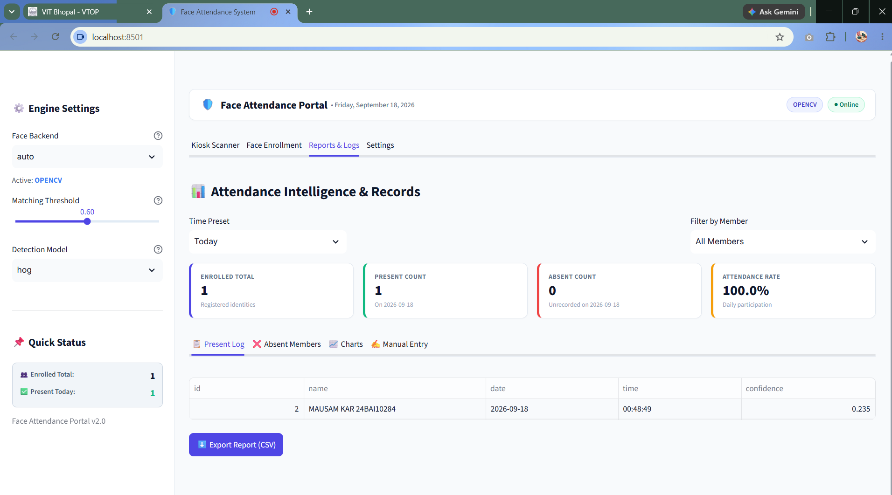
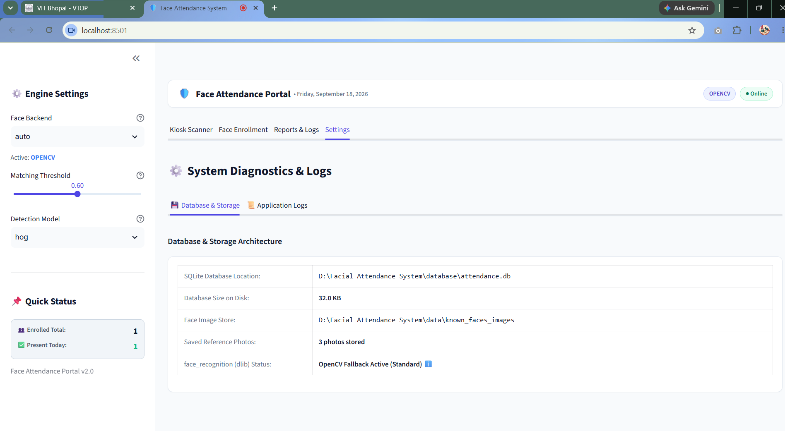
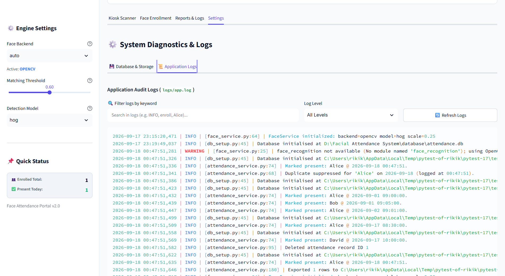
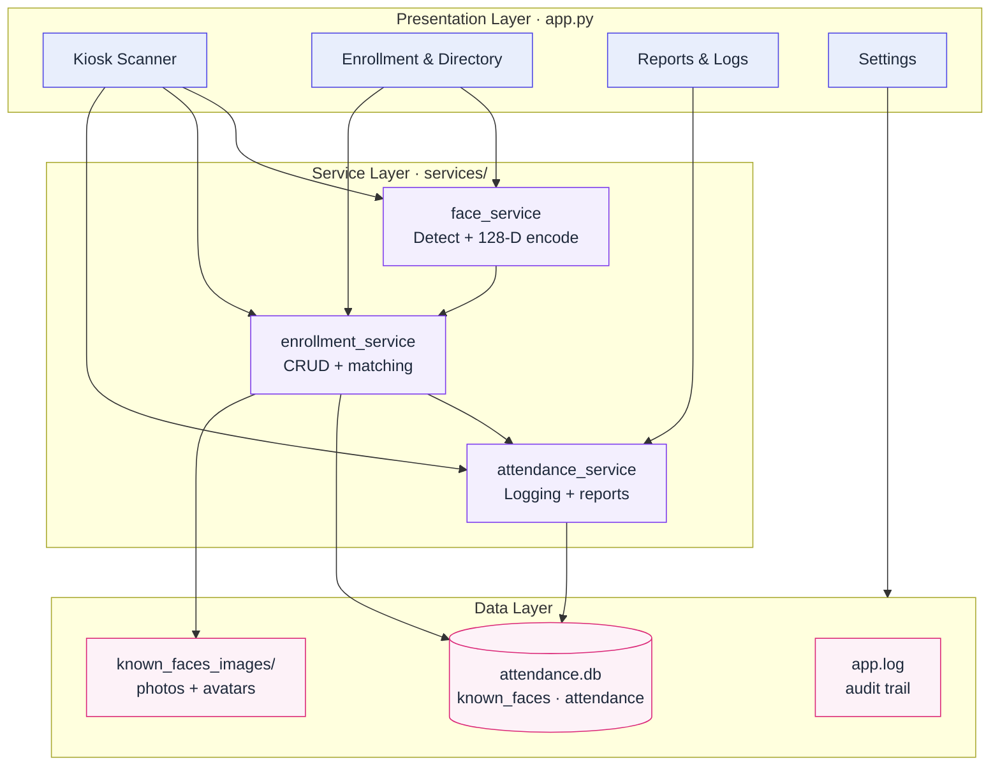
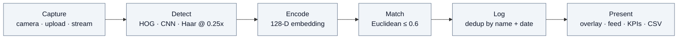

<div align="center">

# Face Recognition–Based Attendance System

**Automated biometric attendance portal built with Computer Vision — face detection, 128-dimensional face embeddings, and Euclidean-distance matching with duplicate-proof daily logging, roster analytics, and a Streamlit kiosk interface.**

[](.)
[](.)
[](.)
[](.)
<br>
[](.)
[](.)
[](.)
[](.)
[](.)
[](.)
[](.)

*Developed by **Mausam Kar** as a Computer Vision assignment for **VITyarthi** at **VIT Bhopal**. This README documents the actual implementation in this repository — no invented features or metrics.*

</div>

---

## 🖼️ Application Interface & System Previews

<div align="center">

| 📷 1. Biometric Kiosk Scanner | 🎯 2. Real-Time Face Recognition |
| :---: | :---: |
| [](docs/screenshots/01_kiosk_webcam_scanner.png) | [](docs/screenshots/02_face_recognition_match.png) |
| *Webcam snapshot, photo upload & today's check-in activity* | *Real-time bounding box detection, match score & instant verification* |
| **🧑 3. Member Face Enrollment** | **📊 4. Attendance Intelligence & Reports** |
| [](docs/screenshots/03_face_enrollment_directory.png) | [](docs/screenshots/04_attendance_intelligence_reports.png) |
| *Single-face quality validation, photo capture & directory* | *Daily KPI analytics, presence logs, confidence scores & CSV export* |
| **⚙️ 5. System Diagnostics & Storage** | **📜 6. Application Audit Logs** |
| [](docs/screenshots/05_system_diagnostics_storage.png) | [](docs/screenshots/06_audit_logs_monitoring.png) |
| *SQLite database metrics, reference store & engine status* | *Live application audit stream, search filters & log levels* |

</div>

---

## 📑 Contents

| # | Section | Description |
| - | ------- | ----------- |
| 1 | [🔭 Overview](#-overview) | What the system does, who it serves, and how the four app tabs fit together |
| 2 | [🎓 Assignment Details](#-assignment-details) | Institution, event, specification sources, and submission status |
| 3 | [🌐 Live Demo — Note for Evaluators](#-live-demo--note-for-evaluators) | Hosted deployment guide and important evaluation notes |
| 4 | [✨ Key Features](#-key-features) | Kiosk scanner, enrollment, attendance intelligence, and reliability |
| 5 | [🎯 Problem Statement and Objectives](#-problem-statement-and-objectives) | The manual-attendance problem and the five implemented objectives |
| 6 | [👁️ Computer Vision Concepts](#-computer-vision-concepts) | Detection, embeddings, matching, and preprocessing techniques used |
| 7 | [🛠️ Technology Stack](#-technology-stack) | Languages, libraries, storage, and tooling with versions and roles |
| 8 | [📁 Project Structure](#-project-structure) | Annotated directory tree and file responsibilities |
| 9 | [🏗️ System Architecture](#-system-architecture) | Three-layer design with a Mermaid architecture diagram |
| 10 | [🔄 Workflow](#-workflow) | Enrollment, recognition, and reporting flows with a Mermaid pipeline |
| 11 | [🧠 Implementation Details](#-implementation-details) | Module-by-module internals (expandable sections) |
| 12 | [🗄️ Database Schema](#-database-schema) | `known_faces` and `attendance` tables, indexes, and constraints |
| 13 | [⚙️ Installation](#-installation) | Environment setup, dependencies, and configuration reference |
| 14 | [▶️ Usage](#-usage) | Launching the portal and walking through a typical session |
| 15 | [📥 Input and Output](#-input-and-output) | Supported inputs and every output the system produces |
| 16 | [📊 Results](#-results) | Verified behavior and how to generate your own evidence |
| 17 | [🧪 Testing](#-testing) | The 13-test pytest suite and what each file covers |
| 18 | [⚠️ Limitations](#-limitations) | Honest constraints supported by the code and specification |
| 19 | [🔮 Future Work](#-future-work) | Realistic extensions, separated from shipped functionality |
| 20 | [🎓 Learning Outcomes](#-learning-outcomes) | CV and engineering concepts exercised by this implementation |
| 21 | [📚 References](#-references) | Documentation for every library and spec actually used |
| 22 | [👤 Author](#-author) | Developer, institution, and submission information |

---

## 🔭 Overview

Manual attendance — roll calls and sign-in sheets — is slow, vulnerable to proxy marking, and difficult to audit. This project replaces it with a **desktop/web-based Face Recognition Attendance System**: an enrolled user faces a webcam (or uploads a photo), and the system detects faces, encodes each into a **128-dimensional embedding**, matches it against enrolled references using **Euclidean distance** (threshold `0.6`), and logs `{name, date, time, confidence}` into SQLite with **per-day duplicate prevention**.

Results are shown with annotated bounding boxes, name badges with match confidence, a live check-in feed, KPI cards, trend charts, CSV export, and a manual admin override — all inside a four-tab Streamlit application:

### 🖥️ Application Tabs

| Tab | Purpose |
| --- | ------- |
| Kiosk Scanner | Webcam snapshot, photo upload, or continuous live feed for check-ins |
| Face Enrollment | Register members, validate face quality, manage the directory |
| Reports & Logs | Present vs. absent roster, filters, charts, CSV export, manual entry |
| Settings | Database statistics and application log viewer |

Built in compliance with the in-repo PRD (`Face_Attendance_System_PRD.md`) and project statement (`statement.md`).

---

## 🎓 Assignment Details

| Field | Details |
| ----- | ------- |
| Institution | VIT Bhopal |
| Assignment | Computer Vision |
| Event | VITyarthi — Build Your Own Project |
| Submitted By | **Mausam Kar** |
| Project Title | Face Recognition–Based Attendance System |
| Specification | `Face_Attendance_System_PRD.md` (v1.0), `statement.md` |
| Core Technologies | Python, OpenCV, Streamlit, NumPy, Pandas, Matplotlib, Altair, SQLite, Pytest |
| Optional Component | `face_recognition` (dlib) — high-accuracy backend |
| Submission Status | Submitted |

---

## 🌐 Live Demo — Note for Evaluators

> Dear evaluator: this project runs both **locally** and as a **hosted web app**. This section covers the hosted deployment and everything needed to evaluate it fairly.

### 🚀 Hosted Deployment (Streamlit Community Cloud)

| Item | Details |
| ---- | ------- |
| Platform | [Streamlit Community Cloud](https://share.streamlit.io) (free hosting for Streamlit apps) |
| Repository | `Mausam5055/Facial-Attendance-System` (branch `main`) |
| Entry point | `app.py` |
| Live URL | `https://facial-attendance-system.streamlit.app` *(assigned at deploy time; if the subdomain differs, use the URL shown on the Cloud dashboard)* |

**Deploy steps (2 minutes):** sign in to [share.streamlit.io](https://share.streamlit.io) with GitHub → Create app → select the repository, branch `main`, and main file `app.py` → Deploy. The first build takes 3–5 minutes.

**Cloud-build readiness (already handled in this repo):**

| Concern | How it is handled |
| ------- | ----------------- |
| No GUI libraries on cloud containers | `requirements.txt` uses `opencv-python-headless` instead of `opencv-python`; the app never opens an OpenCV window, so behavior is identical |
| Chart dependency | `altair` is pinned explicitly since `app.py` imports it directly |
| Heavy dlib build | `face_recognition` stays optional and commented out, so the cloud build never compiles dlib — the app automatically runs on the built-in OpenCV backend there |

### 📌 Important Evaluation Notes

| # | Note | Why it matters |
| - | ---- | -------------- |
| 1 | 🖥️ The cloud server has **no webcam** — evaluate the Kiosk Scanner via **Upload Photo** mode (single or group photo), and enroll members via **image upload** rather than webcam capture | Webcam Snapshot and Live Feed require a client camera and only work in the local run |
| 2 | 💾 Hosted storage is **ephemeral** — enrolled faces and attendance records reset if the app reboots or sleeps | For repeatable evaluation, enroll fresh members each session; the local run persists everything in `database/attendance.db` |
| 3 | 🔄 The cloud deployment runs the **OpenCV fallback backend** (Haar + handcrafted 128-d embedding), not the dlib backend | This is the correct, supported configuration — matching threshold and behavior are unchanged |
| 4 | ✅ For the full experience (webcam + live feed + persistent data), run locally with `python -m streamlit run app.py` | See [⚙️ Installation](#-installation) and [▶️ Usage](#-usage) |
| 5 | 🧪 Correctness is covered by **13 automated pytest tests** (`python -m pytest`) covering embeddings, enrollment, matching, duplicate prevention, roster, and CSV export | See [🧪 Testing](#-testing) |

---

## ✨ Key Features

### 📷 Multi-Mode Kiosk Scanner

Three check-in paths share one recognition pipeline: instant webcam snapshots with real-time bounding boxes and match-confidence badges, single/group photo upload (every face in the frame is matched independently), and a continuous OpenCV live-stream loop that re-processes every Nth frame for smooth performance with duplicate suppression.

### 🧑 Enrollment with Quality Control

Registration requires exactly one clearly visible face — the validator rejects empty frames and multi-face photos with actionable messages. Members can add extra reference photos (improving robustness across lighting and angles), get auto-generated avatar thumbnails, and appear in a searchable directory with add-photo and delete actions.

### 📊 Attendance Intelligence

Filter records by Today, Yesterday, Last 7 Days, This Month, All Time, or a custom range plus per-member filtering. KPI cards show enrolled total, present count, absent count, and attendance rate. A dedicated absent roster names everyone unrecorded on a given date. Daily-volume and per-member frequency charts, one-click CSV export, and a manual admin override round out reporting.

### 🛡️ Reliability by Design

Same-day re-recognition returns *"Already marked present today"* instead of a duplicate row (enforced by both application logic and a `UNIQUE(name, date)` constraint). `Unknown` faces are never logged. The pipeline never crashes on empty frames, missing faces, camera disconnects, or corrupt uploads. A dual backend — `face_recognition` (dlib) when installed, automatic fallback to a built-in OpenCV Haar + handcrafted 128-d embedding otherwise — keeps the app runnable on any machine, including Python versions without dlib wheels.

---

## 🎯 Problem Statement and Objectives

### ❓ Problem Statement

Manual attendance marking is time-consuming, allows proxy attendance (one person marking for another), and produces records that are hard to audit or analyze. Classrooms, training sessions, and small offices need a lightweight, low-cost system that recognizes known individuals automatically from a standard webcam — no dedicated biometric hardware (PRD Section 2, `statement.md`).

### ✅ Objectives

All five objectives from PRD Section 3 are implemented:

1. Automatically detect and recognize enrolled faces from a webcam feed or uploaded image.
2. Let an admin enroll new users by capturing or uploading reference face images.
3. Prevent duplicate attendance entries for the same person on the same day.
4. Persist records and support filtering/reporting by date, range, and person.
5. Provide real-time visual feedback (bounding box + name + confidence) during recognition.

---

## 👁️ Computer Vision Concepts

| Concept | Why it is used | How it works (briefly) | How this project applies it |
| ------- | -------------- | ---------------------- | --------------------------- |
| Face detection (HOG / CNN) | Locate faces fast and accurately | HOG counts edge orientations; CNN learns facial patterns | `face_service.py` runs `face_recognition.face_locations` on a 0.25x downscaled frame (selectable `hog` / `cnn`), then rescales boxes to full resolution |
| Face detection (Haar cascade) | Universal fallback without dlib | Pretrained Haar classifiers scan grayscale at multiple scales | `CascadeClassifier(haarcascade_frontalface_default.xml)` with `scaleFactor=1.1, minNeighbors=5, minSize=(25,25)` |
| Face embeddings (128-d) | Comparable numeric signature per face | A model maps a face crop to a 128-vector; same person yields nearby vectors | Primary: dlib encodings. Fallback: 64-d intensity thumbnail + 64-d Sobel-gradient features, concatenated and L2-normalized to a deterministic 128-d unit vector |
| Image preprocessing | Speed and lighting robustness | Smaller images process faster; grayscale + histogram equalization evens out lighting | 0.25x frame downscaling, grayscale conversion, `64x64` standardization, histogram equalization, `8x8` feature thumbnails |
| Euclidean-distance matching | Identity decision | Distance between vectors measures dissimilarity; below threshold means match | Nearest-neighbor search over all stored encodings with `argmin`; distance `<= 0.6` assigns the identity, otherwise `Unknown` |
| Multi-face handling | Group photos and enrollment quality | Detect all faces; enrollment expects exactly one reference face | Kiosk loops over every detection; enrollment rejects zero-face and multi-face inputs with explicit errors |
| Geometric post-processing | Clean crops and accurate display | Pad and clamp boxes; scale coordinates back up; draw overlays | Padded face crops for avatars/previews; boxes rescaled by `1/scale`; color-coded overlays (marked / recognized / unknown) with `Name (XX%)` badges where XX = `(1 - min(dist,1)) x 100` |
| Frame-rate optimization | Real-time performance on CPU | Process fewer, smaller frames | 0.25x scaling combined with processing every 2nd frame targets 10+ FPS on a standard laptop |

No CNN classifier training, image segmentation, or general object detection is implemented, and none is claimed.

---

## 🛠️ Technology Stack

| Layer | Technology | Version | Role |
| ----- | ---------- | ------- | ---- |
| Language | Python | 3.10+ (3.10–3.11 recommended with dlib) | Core implementation |
| Vision | OpenCV (`opencv-python`) | >= 4.8, < 5 | Capture, resizing, Haar detection, Sobel gradients, annotation |
| Face encoding (optional) | `face_recognition` (dlib) | installed manually | High-accuracy HOG/CNN detection and 128-d encodings |
| Numerics | NumPy | >= 1.24 | Embedding vectors, vectorized distance computation |
| Data | Pandas | >= 2.0 | Report queries, roster computation, CSV export |
| Visualization | Matplotlib, Altair | >= 3.7 | Plotting backend; declarative dashboard charts |
| Interface | Streamlit | >= 1.32 | Four-tab portal, camera input, tables, downloads |
| Styling | Custom CSS + `.streamlit/config.toml` | — | Light SaaS theme (Indigo `#4F46E5` on slate) |
| Storage | SQLite (`sqlite3`, standard library) | file-based | `known_faces` and `attendance` tables |
| Testing | Pytest | >= 7.0 | 13 unit and integration tests |
| Process | Git + GitHub, PRD + statement docs | — | Version control and specification |

SQLite was chosen over CSV (per PRD Section 8) for atomic duplicate-checked writes, indexed date/name queries, and clean CRUD semantics.

---

## 📁 Project Structure

```
Facial Attendance System/
├── app.py                        # Streamlit entry point — four tabs and sidebar engine settings
├── config.py                     # Central config: paths, threshold, model, scale, backend, logging
├── requirements.txt              # Core dependencies (face_recognition optional, documented inline)
├── statement.md                  # One-page project statement: problem, modules, stack
├── Face_Attendance_System_PRD.md # Full PRD v1.0: requirements, architecture, schema, test plan
├── BuildYourOwnProjectVITyarthi.pdf
├── services/
│   ├── face_service.py           # Module 1 — detection and 128-d encoding (dlib + OpenCV fallback)
│   ├── enrollment_service.py     # Module 2 — enroll / list / delete and Euclidean matching
│   └── attendance_service.py     # Module 3 — deduped logging, reports, analytics, CSV export
├── database/
│   ├── db_setup.py               # Schema creation, connections, initialization
│   └── attendance.db             # SQLite file (created at runtime, gitignored)
├── data/
│   └── known_faces_images/       # Per-person references: <Name>/ref_<timestamp>.jpg + avatar.jpg
├── tests/
│   ├── test_face_service.py      # Detection safety, deterministic 128-d embeddings, distance math
│   ├── test_enrollment_service.py# Enroll / match / delete, no-face and multi-face rejection
│   └── test_attendance_service.py# Dedup, Unknown guard, filters, roster, manual mark, CSV export
├── assets/
│   └── custom.css                # Portal design system: navbar, badges, KPI cards, tabs, feed
├── .streamlit/
│   └── config.toml               # Theme, server port 8501, minimal toolbar
├── logs/
│   └── app.log                   # Runtime audit log (created at runtime, gitignored)
├── docs/
│   └── screenshots/              # High-resolution application preview screenshots (2×3 matrix)
├── Preview images/               # App preview captures
└── README.md                     # This file
```

| Path | Responsibility |
| ---- | -------------- |
| `app.py` | UI orchestration, cached service instantiation, all four tabs, charts, downloads |
| `config.py` | `RECOGNITION_THRESHOLD=0.6`, `DETECTION_MODEL="hog"`, `FRAME_SCALE=0.25`, `PROCESS_EVERY_N_FRAMES=2`, `FACE_BACKEND="auto"` |
| `services/face_service.py` | `FaceService`, backend resolution, detect/encode/embed/crop/draw helpers |
| `services/enrollment_service.py` | `EnrollmentService`: enroll, list, count, delete, single-vector and full-frame recognition |
| `services/attendance_service.py` | `AttendanceService`: mark, manual override, filtered reports, daily roster, summaries, CSV |
| `database/db_setup.py` | Idempotent schema setup with indexes; shared connection helper |
| `data/known_faces_images/` | On-disk reference photos and avatars backing the encoded vectors |
| `tests/` | 13 tests runnable with `python -m pytest` |

---

## 🏗️ System Architecture

Three layers with a strict downward dependency: the presentation layer never touches storage directly; all data access flows through the service layer.



Module 1 feeds Module 2 (vectors in, identities out); Module 2 feeds Module 3 (identities in, records out). Every service logs through the shared `config.log` handler.

---

## 🔄 Workflow

### 1️⃣ Enrollment Flow

Admin enters a name and captures or uploads a photo. Module 1 detects and encodes the face. Module 2 stores the encoding in `known_faces` and saves the reference photo plus avatar thumbnail to disk.

### 2️⃣ Recognition and Attendance Flow

A frame arrives from snapshot, upload, or live stream. Module 1 detects all faces and encodes each. Module 2 compares every encoding against all stored references and assigns the best match under the threshold, else `Unknown`. Module 3 checks for an existing `(name, date)` record — inserting a new row on first sighting, suppressing duplicates with the original check-in time otherwise. The UI overlays color-coded boxes with name and match-score badges and appends fresh check-ins to the live feed.

### 3️⃣ Reporting Flow

Admin selects a preset or custom range plus an optional member filter. Module 3 queries the database into Pandas, derives the present/absent roster and summary statistics, and renders tables, KPI cards, charts, and a downloadable CSV.



| Stage | Input | Operation | Output |
| ----- | ----- | --------- | ------ |
| Capture | Camera / file | `st.camera_input`, `st.file_uploader` + `cv2.imdecode`, or `cv2.VideoCapture` loop | BGR frame |
| Detect | BGR frame | Downscale 0.25x, HOG/CNN or Haar cascade, rescale boxes | Bounding boxes |
| Encode | Face crops | dlib 128-d or intensity + gradient 128-d, L2-normalized | Embedding vectors |
| Match | Vectors + stored matrix | Vectorized Euclidean `argmin` vs. 0.6 threshold | Identity or `Unknown` + distance |
| Log | Identities | Duplicate `SELECT`, conditional `INSERT` | Database rows |
| Present | Rows + frames | Overlays, feed, KPIs, charts, CSV | Interface and files |

---

## 🧠 Implementation Details

<details>
<summary><strong>1️⃣ Module 1 — Face detection and encoding</strong> (<code>services/face_service.py</code>)</summary>

<br>

- `active_backend()` resolves `auto` to `face_recognition` when dlib is importable, otherwise `opencv`; an explicit `face_recognition` request degrades gracefully with a warning instead of crashing.
- `_detect_fr()` resizes to 0.25x, converts to RGB, calls `face_locations` then `face_encodings`, and rescales each box by `1/scale` into original coordinates.
- `_detect_opencv()` converts to grayscale, downscales, runs the Haar cascade (`scaleFactor=1.1, minNeighbors=5, minSize=(25,25)`), clamps boxes to the frame, and embeds each crop.
- `_embed()` standardizes to `64x64`, equalizes the histogram, extracts an `8x8` intensity thumbnail (64-d) and an `8x8` Sobel-magnitude map (64-d, self-normalized), concatenates, and L2-normalizes to a unit-length 128-d vector. Identical crops always yield identical vectors.
- `detect_and_encode()` never raises on bad input — `None`, empty arrays, and zero-face frames return `[]`.
- `draw_boxes()` renders emerald (newly marked), amber (recognized), and rose (unknown) boxes with corner accents and solid label badges showing `Name (XX% match)`.

</details>

<details>
<summary><strong>2️⃣ Module 2 — Enrollment and matching</strong> (<code>services/enrollment_service.py</code>)</summary>

<br>

- `enroll()` validates the name and image, requires exactly one face by default (`allow_multi_face=False` raises on zero or multiple faces), inserts the pickled encoding into `known_faces`, and writes `ref_<timestamp>.jpg` plus an `avatar.jpg` crop. Re-enrolling the same name adds another reference row, improving recall.
- `list_users()` / `count()` aggregate by name with photo counts, earliest enrollment date, and resolved avatar paths.
- `delete_user()` removes all encoding rows for a name and deletes its photo directory (best-effort, logged on failure).
- `recognize()` stacks every stored encoding into a matrix, computes one vectorized Euclidean pass, takes the `argmin`, and returns the name only when the distance is within threshold.
- `recognize_frame()` chains detection and single-vector recognition into the `[(name, box, distance)]` tuples consumed by the UI. Matching is O(n) over stored encodings — appropriate for the 50-user scalability target.

</details>

<details>
<summary><strong>3️⃣ Module 3 — Logging, roster, and analytics</strong> (<code>services/attendance_service.py</code>)</summary>

<br>

- `mark_attendance()` rejects empty and `Unknown` names, performs a duplicate `SELECT` on `(name, date)`, and inserts `{name, date, time, confidence}` only for genuinely new check-ins, returning `(is_new, message)` in all cases.
- `manual_mark()` wraps the same path for admin overrides (stored with `confidence=1.0`).
- `get_report()` builds a parameterized `SELECT ... WHERE` from optional date/start/end/name filters, ordered by date then time descending, returned as a Pandas DataFrame.
- `get_daily_roster()` diffs the enrolled-name set against the day's present set to produce counts, attendance rate, present records, and the sorted absent list.
- `summary()` aggregates total records, unique people, covered days, and per-person / per-day distributions for the charts.
- `export_csv()` writes any filtered report to disk and logs the row count.

</details>

---

## 🗄️ Database Schema

Defined in `database/db_setup.py` (PRD Section 10). Connections use the `sqlite3.Row` factory; `init_db()` runs idempotently at every startup.

### 🗂️ Table: `known_faces`

One row per reference photo:

| Column | Type | Notes |
| ------ | ---- | ----- |
| `id` | INTEGER PRIMARY KEY | Auto-increment |
| `name` | TEXT NOT NULL | Indexed person name |
| `encoding` | BLOB NOT NULL | Pickled 128-d NumPy array |
| `enrolled_on` | TIMESTAMP | Defaults to `CURRENT_TIMESTAMP` |

### 📝 Table: `attendance`

One row per person per day:

| Column | Type | Notes |
| ------ | ---- | ----- |
| `id` | INTEGER PRIMARY KEY | Auto-increment |
| `name` | TEXT NOT NULL | Natural key to `known_faces.name` |
| `date` | DATE NOT NULL | Indexed; part of `UNIQUE(name, date)` |
| `time` | TIME NOT NULL | First-seen time of day |
| `confidence` | FLOAT | Match distance recorded at check-in |

Indexes: `idx_known_faces_name`, `idx_attendance_date`, `idx_attendance_name`. The PRD notes a future improvement of replacing the natural-key join with a `face_id` foreign key.

---

## ⚙️ Installation

Prerequisites: Python 3.10+, Git, and optionally a webcam (photo upload works without one).

```bash
# Clone the repository
git clone <your-repo-url>
cd "Facial Attendance System"

# Create and activate a virtual environment
python -m venv .venv
.venv\Scripts\activate        # Windows
# source .venv/bin/activate   # macOS / Linux

# Install core dependencies
pip install -r requirements.txt
```

Optional high-accuracy backend (best on Python 3.10–3.11, where dlib wheels exist):

```bash
pip install face_recognition
```

No dataset download or manual configuration is required. `config.py` creates `database/`, `data/known_faces_images/`, `logs/`, and `assets/` on first import, and `init_db()` creates the tables on startup.

Key settings in `config.py`:

| Parameter | Default | Effect |
| --------- | ------- | ------ |
| `RECOGNITION_THRESHOLD` | `0.6` | Maximum Euclidean distance for a match; lower is stricter |
| `DETECTION_MODEL` | `"hog"` | `"hog"` is CPU-fast; `"cnn"` is more accurate but slower without GPU |
| `FRAME_SCALE` | `0.25` | Downscale factor before processing; smaller is faster |
| `PROCESS_EVERY_N_FRAMES` | `2` | Live-feed stride; higher values smooth video but refresh identity slower |
| `FACE_BACKEND` | `"auto"` | `auto`, `face_recognition`, or `opencv` |

---

## ▶️ Usage

```bash
# Launch the portal (opens at http://localhost:8501)
python -m streamlit run app.py

# Run the test suite
python -m pytest
```

### 🖥️ Typical Session

First, adjust the sidebar engine settings (backend, matching threshold, detection model) and confirm the active backend badge. Then open **Kiosk Scanner** and check in via webcam snapshot, photo upload, or the live feed toggle — recognized faces are annotated and appear in the **Today's Check-ins** feed. Next, use **Face Enrollment** to register members: enter a name, capture or upload a photo, wait for the single-face confirmation and preview, then complete enrollment. Finally, open **Reports & Logs** to filter by preset or member, review KPI cards and the present/absent lists, inspect the charts, export CSV, or add a manual entry. **Settings** exposes database statistics and a searchable application log viewer with download.

> 💡 **Reproducing results end to end:** enroll at least one member under good frontal lighting, scan the same face through each kiosk mode, and verify the annotated output plus the Tab 3 records.

---

## 📥 Input and Output

### 📥 Inputs

| Type | Formats / constraints | Notes |
| ---- | --------------------- | ----- |
| Webcam snapshot | Browser camera via `st.camera_input` | Requires camera permission; frontal lighting matters |
| Uploaded photo | `jpg`, `jpeg`, `png` | Single or group photo; exactly one face recommended for enrollment |
| Live video | `cv2.VideoCapture`, index 0–5 | Standard webcam; recognition runs every Nth frame |
| Member name | Non-empty text | Sanitized to alphanumeric, `-`, `_` directory names |
| Report filters | Preset, custom date range, member name | Today through All Time plus arbitrary ranges |

> ⚠️ Invalid frames, zero-face images, camera failures, and corrupt uploads produce user-facing warnings — never a crash.

### 📤 Outputs

| Output | Form | Meaning |
| ------ | ---- | ------- |
| Annotated frame | Image / video with boxes and badges | Emerald `Name (XX%)` = newly marked; amber = recognized; rose `Unknown` = not enrolled |
| Check-in feedback | Success / info / warning banners | Marked present, already-marked time, or a prompt to enroll |
| Present log | Table with CSV download | `{id, name, date, time, confidence}` rows matching the filters |
| Absent roster | Table | Enrolled names with no record on the selected date |
| Analytics | KPI cards and bar charts | Enrolled / present / absent / rate, daily volume, per-member frequency |
| Audit log | `logs/app.log` | Timestamped record of enrollments, recognitions, and database events |
| Stored artifacts | SQLite rows, reference photos, avatars | Persist across restarts and power future matching |

---

## 📊 Results

> 📌 No screenshots or sample outputs are bundled in this repository (`docs/` is empty; image and log artifacts are runtime-generated and gitignored), so none are embedded here. The table below describes behavior verified through the test suite and code paths:

| Check | Demonstrates | Observable behavior |
| ----- | ------------ | ------------------- |
| Blank, `None`, and empty frames | Crash-safe pipeline on faceless input | Empty result with a *"No face detected"* warning |
| Deterministic 128-d embedding | Same crop always yields the same unit-length vector | `test_embed_is_deterministic_128d` passes |
| Enroll, recognize, delete | Threshold matching: near vector accepted, distant vector rejected | Exact vector matches below 0.6; far vector returns `Unknown` |
| Duplicate suppression | One row per person per day | Second same-day mark returns `False`; row count unchanged |
| Daily roster | Correct present/absent split | Fixture with 3 enrolled and 1 recorded yields 1 present, 2 absent |
| Filters, summary, CSV export | Queryable, exportable records | Date/person/range filters return expected subsets; CSV contains enrolled names |

> 📌 No accuracy, precision, recall, FPS, or timing figures are claimed — none are measured in this repository. To produce evidence, enroll two or three members, scan via each kiosk mode, and save the annotated results plus report views under `docs/`.

---

## 🧪 Testing

13 tests, runnable offline with the OpenCV backend (no dlib, camera, or network required):

```bash
python -m pytest        # full suite
python -m pytest -v     # verbose per-test output
```

| File | Tests | Coverage |
| ---- | ----- | -------- |
| `tests/test_face_service.py` | 4 | Blank-image and null-input safety, deterministic 128-d unit embeddings, zero distance for identical vectors |
| `tests/test_enrollment_service.py` | 3 | Enroll-list-recognize-delete round trip, no-face rejection, multi-face rejection |
| `tests/test_attendance_service.py` | 6 | Marking, same-day duplicate prevention, `Unknown` guard, report filters and summaries, present/absent roster, manual mark with delete, CSV export |

---

## ⚠️ Limitations

Constraints supported by the code and specification — stated plainly, without invention:

| # | Limitation | Details |
| - | ---------- | ------- |
| 1 | Environment sensitivity | Recognition degrades under poor lighting, extreme pose, or low resolution; this affects the handcrafted OpenCV embedding most. The enrollment validator exists to mitigate it. |
| 2 | 🎭 No liveness detection | A printed photograph can match a live face. Anti-spoofing is explicitly out of scope (PRD Section 5). |
| 3 | 📉 Fallback accuracy gap | The OpenCV 128-d descriptor is deterministic but far less discriminative than dlib ResNet embeddings; the shared `0.6` threshold may need per-backend tuning. |
| 4 | 💻 Local single-machine scope | No authentication, multi-camera, multi-room, cloud sync, or mobile client — by design. |
| 5 | 📈 Linear matching cost | Embedding comparison is O(n) over stored references: fine for tens of users, unsuitable for thousands without an index. |
| 6 | 🏷️ Name as natural key | Duplicate names are ambiguous; the PRD proposes a future `face_id` foreign key. |
| 7 | 🖼️ Missing diagrams | The architecture, ER, use-case, and sequence diagrams listed in PRD Section 14 are not yet present under `docs/`. |

---

## 🔮 Future Work

Realistic extensions, kept separate from shipped functionality:

| # | Enhancement | Details |
| - | ----------- | ------- |
| 1 | Liveness and anti-spoofing | Blink challenge, texture analysis, or depth cues to reject printed-photo spoofs. |
| 2 | Stronger embeddings | FaceNet / ArcFace via ONNX with cosine similarity and per-backend threshold calibration. |
| 3 | Face tracking | Temporal identity smoothing and tracking to stabilize the live feed. |
| 4 | Access and scale-out | Admin authentication and roles; multi-camera and multi-room support; cloud backup. |
| 5 | Data model and indexing | `face_id` foreign key, photo deduplication, and vector indexing (e.g., FAISS) for scale. |
| 6 | Integrations | REST API for HRMS integration; packaged kiosk and mobile clients. |
| 7 | Evaluation harness | Measured precision, recall, FAR/FRR, and latency to replace qualitative assessment. |
| 8 | Documentation | Populated `docs/` with the four PRD diagrams plus annotated demo screenshots. |

---

## 🎓 Learning Outcomes

Concepts directly exercised by this implementation:

| # | Area | Concepts exercised |
| - | ---- | ------------------ |
| 1 | Image processing | Color-space conversion, resizing, histogram equalization, Sobel gradients, padded cropping. |
| 2 | Face detection paradigms | HOG and CNN detectors versus Haar cascades, and their speed/accuracy trade-offs. |
| 3 | Metric-space recognition | Normalized embeddings, Euclidean nearest neighbors, threshold classification. |
| 4 | Data engineering | Relational schema design, binary vector storage, uniqueness constraints, parameterized queries, Pandas analytics. |
| 5 | Systems design | Layered modular architecture, centralized configuration, dual-backend resilience, graceful degradation. |
| 6 | Applied UX for vision systems | Real-time overlays, confidence display, input validators, roster analytics, CSV and log ergonomics. |
| 7 | Software quality | Unit and integration testing, audit logging, duplicate-safe writes, input validation. |

---

## 📚 References

Only sources connected to artifacts actually used or cited in this repository:

| # | Resource | Covers | Link |
| - | -------- | ------ | ---- |
| 1 | OpenCV documentation | Image and video operations, Haar cascades, Sobel | <https://docs.opencv.org> |
| 2 | `face_recognition` by Adam Geitgey (dlib) | HOG/CNN detection and 128-d encodings | <https://github.com/ageitgey/face_recognition> |
| 3 | Streamlit documentation | Camera input, tabs, caching, downloads | <https://docs.streamlit.io> |
| 4 | Altair visualization library | Declarative charts | <https://altair-viz.github.io> |
| 5 | Pandas · NumPy · Matplotlib | Data analysis, numerics, plotting | <https://pandas.pydata.org> · <https://numpy.org> · <https://matplotlib.org> |
| 6 | SQLite documentation | SQL syntax, constraints, indexes | <https://www.sqlite.org/docs.html> |
| 7 | Pytest documentation | Test running, fixtures, assertions | <https://docs.pytest.org> |
| 8 | In-repo specification | `Face_Attendance_System_PRD.md`, `statement.md` | — |

---

## 👤 Author

| Field | Details |
| ----- | ------- |
| Institution | VIT Bhopal |
| Event | VITyarthi — Build Your Own Project |
| Domain | Computer Vision assignment |
| Project | Face Recognition–Based Attendance System |
| Submitted By | **Mausam Kar** |
| GitHub | [Mausam5055](https://github.com/Mausam5055) |

<div align="center">

*Standard webcam in, trustworthy attendance out.*

</div>
