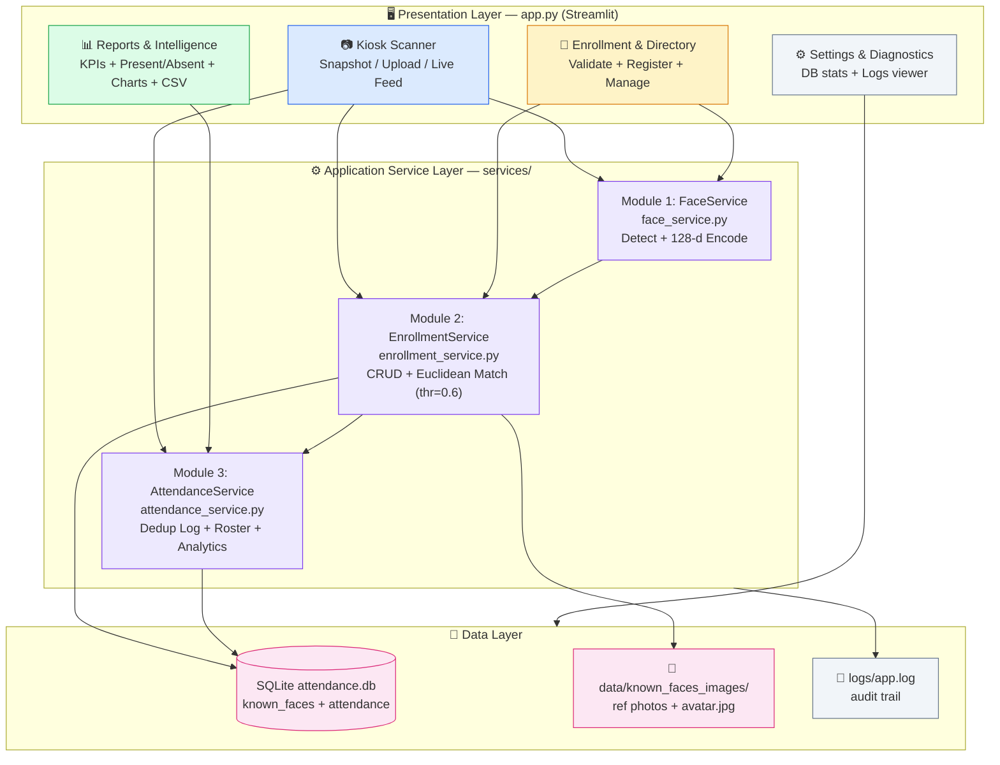
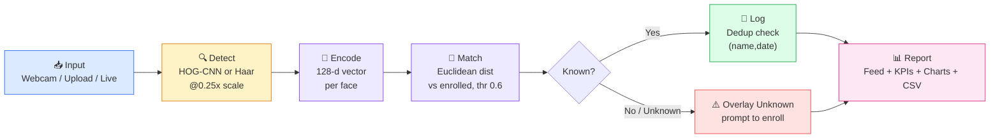

# 🛡️ Face Recognition–Based Attendance System

> **Automated biometric attendance portal using Computer Vision — face detection, 128-D face embeddings & Euclidean matching with duplicate-proof daily logging, roster analytics, and a Streamlit kiosk UI.**


**Developed as a Computer Vision assignment for VITyarthi at VIT Bhopal — submitted by me.** Built in compliance with the project PRD (`Face_Attendance_System_PRD.md`) and project statement (`statement.md`). This README documents the actual implementation found in this repository — no invented features or metrics.

---

## 📑 Table of Contents

1. [Overview](#-overview)
2. [Assignment Information](#-assignment-information)
3. [Features](#--features)
4. [Problem Statement](#-problem-statement)
5. [Objectives](#-objectives)
6. [Computer Vision Concepts Used](#-computer-vision-concepts-used)
7. [Technology Stack](#-technology-stack)
8. [Project Structure](#-project-structure)
9. [System Architecture](#-system-architecture)
10. [End-to-End Workflow](#-end-to-end-workflow)
11. [Implementation Details](#-implementation-details)
12. [Database Design](#-database-design)
13. [Installation and Setup](#-installation-and-setup)
14. [Usage Instructions](#-usage-instructions)
15. [Input and Output](#-input-and-output-documentation)
16. [Results and Visualizations](#-results-and-visualizations)
17. [Component Responsibilities](#-architecture-and-technical-design-tables)
18. [Challenges and Limitations](#-challenges-and-limitations)
19. [Future Enhancements](#-future-enhancements)
20. [Learning Outcomes](#-learning-outcomes)
21. [References](#-references-and-resources)
22. [Author and Submission Information](#-author-and-submission-information)

---

## 🔭 Overview

This project is a **desktop/web-based Face Recognition Attendance System**. Instead of manual roll-calls or sign-in sheets, an enrolled user simply faces a webcam (or uploads a photo / group photo) and the system:

1. **Detects** all faces in the frame,
2. **Encodes** each face into a **128-dimensional embedding vector**,
3. **Matches** it against enrolled reference encodings using **Euclidean distance** with a configurable threshold (default `0.6`),
4. **Logs** `{name, date, time, confidence}` into SQLite with **per-day duplicate prevention**,
5. **Visualizes** results with bounding boxes, name badges + match-confidence, live check-in feed, KPI cards, and trend charts, with **CSV export** and manual admin override.

**Why it is relevant to Computer Vision:** every core step — detection (HOG / CNN / Haar cascade), preprocessing (downscaling, grayscale, histogram equalization, gradient features), embedding generation, distance-based classification, bounding-box geometry, and annotated visual feedback — is a classical + practical CV pipeline applied to a real attendance problem.

**How the user interacts with it:** through a 4-tab Streamlit app (`app.py`): **Kiosk Scanner → Face Enrollment → Reports & Logs → Settings & Diagnostics**. A sidebar exposes engine settings (backend, threshold, detection model) and live counts.

---

## 🎓 Assignment Information

| Field | Details |
| ----- | ------- |
| Institution | VIT Bhopal |
| Assignment | Computer Vision |
| Event / Assignment Name | VITyarthi — *Build Your Own Project* |
| Project Title | Face Recognition–Based Attendance System (Face Attendance Portal) |
| Problem Source | `statement.md` + `Face_Attendance_System_PRD.md` (v1.0) in this repo |
| Technologies | Python, OpenCV, Streamlit, NumPy, Pandas, Matplotlib, Altair, SQLite, Pytest (optional: `face_recognition` / dlib) |
| Submission Status | Submitted |

The project directly satisfies the assignment brief: a modular CV application (detection + encoding, enrollment + matching, logging + reporting) with functional/non-functional requirements, architecture, workflow, database schema, testing plan, and a working demo.

---

## ✨ Features

- 📷 **Kiosk Scanner (3 input modes)** — `Webcam Snapshot` (browser camera), `Upload Photo` (single/group JPG/PNG), and `Live Camera Feed` (continuous OpenCV loop, processing every Nth frame). Annotated output with corner-accent boxes + `✓ Name (XX% match)` badges.
- 🧑 **Face Enrollment & Members Directory** — name + webcam/upload photo, single-face quality validator, multi-photo re-enrollment (improves lighting/angle robustness), avatar thumbnails, searchable directory table, add-photo / delete-member management.
- 📊 **Attendance Intelligence & Reports** — presets (Today / Yesterday / Last 7 Days / This Month / All Time / Custom Range) + member filter, KPI cards (Enrolled, Present, Absent, Attendance Rate %), Present log, Absent roster, Altair daily-trend + per-member frequency charts, one-click CSV export, manual admin override.
- 🛡️ **Duplicate Prevention** — `UNIQUE(name, date)` constraint + application check; re-recognition the same day returns *"Already marked present today at HH:MM:SS"* instead of a new row.
- 🔄 **Dual Backend Engine** — `face_recognition` (dlib 128-d, high accuracy) when installed; automatic fallback to built-in **OpenCV Haar + 128-d multi-feature embedding** so the app runs on any machine (e.g. Python 3.12+ without dlib wheels). Selectable via `auto | face_recognition | opencv`.
- 💾 **Persistent Local Storage** — SQLite (`database/attendance.db`) + reference photos in `data/known_faces_images/<Person>/` + audit log `logs/app.log`.
- ⚙️ **Diagnostics** — DB path/size/photo count/backend status viewer, searchable log viewer with level filter + download.
- 🧪 **Tested** — 13 pytest unit/integration tests covering embeddings, enrollment CRUD, matching threshold, duplicates, roster, manual mark, CSV export, and no-face robustness.

> Only implemented features are listed above. Liveness/anti-spoofing, multi-camera, cloud auth, and mobile app are explicitly out of scope (see PRD §5).

---

## 🧩 Problem Statement

Manual attendance (roll call, sign-in sheets) is **slow, allows proxy attendance** (one person marking for another), and is **hard to audit or analyze**. Classrooms, training sessions, and small offices need a lightweight, low-cost system that recognizes known individuals automatically from a standard webcam — without expensive biometric hardware — and produces trustworthy, queryable records (PRD §2, `statement.md`).

---

## 🎯 Objectives

Derived directly from PRD §3:

- [x] Automatically **detect and recognize enrolled faces** from webcam feed or uploaded image (Module 1 + 2).
- [x] Let an admin **enroll new users** via captured/uploaded reference photos (Module 2: create/read/update/delete).
- [x] **Prevent duplicate entries** for the same person on the same day (Module 3).
- [x] **Persist records** and support filtering/reporting by date, range, and person + CSV export (Module 3).
- [x] Provide **real-time visual feedback** — bounding box + name + confidence overlay during recognition.

---

## 👁️ Computer Vision Concepts Used

| Concept | Purpose | Working (simplified) | Implementation in this project | Output |
| ------- | ------- | -------------------- | ------------------------------ | ------ |
| Face Detection (HOG / CNN) | Locate faces quickly/accurately | HOG counts edge orientations; CNN learns face patterns | `face_service.py::_detect_fr` → `face_recognition.face_locations(rgb, model="hog"\|"cnn")` on 0.25x frame | `(top, right, bottom, left)` boxes, rescaled to original size |
| Face Detection (Haar Cascade fallback) | Universal detection without dlib | Pretrained Haar classifiers scan grayscale at multiple scales | `face_service.py::_detect_opencv` → `CascadeClassifier(haarcascade_frontalface_default.xml).detectMultiScale(scaleFactor=1.1, minNeighbors=5, minSize=(25,25))` | Face boxes when `face_recognition` is unavailable |
| Face Embeddings (128-d) | Turn a face into a comparable numeric signature | dlib ResNet maps a face to a 128-d vector; same person → nearby vectors | `face_recognition.face_encodings()` (primary); fallback `_embed()` builds 64-d intensity thumbnail + 64-d Sobel-gradient features, L2-normalized to 128-d | `np.ndarray` shape `(128,)` per face |
| Image Preprocessing | Speed + lighting robustness | Downscale for FPS; grayscale + histogram equalization evens lighting; resize standardizes size | `FRAME_SCALE=0.25` resize; `cvtColor→GRAY`, `resize(64×64)`, `equalizeHist`, `resize(8×8)` thumbnails in `_embed()` | Smaller, normalized inputs for detection/embedding |
| Edge / Gradient Features | Capture facial structure beyond raw pixels | Sobel filters measure horizontal/vertical intensity change; magnitude = edge strength | `cv2.Sobel(gx, gy) → cv2.magnitude → 8×8 → normalized 64-d` concatenated with intensity vector | Lighting-tolerant half of the fallback embedding |
| Euclidean-Distance Matching | Decide *who* a face belongs to | Distance between vectors ≈ dissimilarity; below threshold = match | `enrollment_service.py::recognize` → `np.linalg.norm(matrix - candidate, axis=1)`, `argmin`, threshold `0.6` (`RECOGNITION_THRESHOLD`) | `(name | "Unknown", best_distance)` |
| Multi-face Handling | Support group photos + quality control | Detect all faces; enrollment expects exactly one reference face | `detect_and_encode` returns list; `enroll(allow_multi_face=False)` raises on 0 or >1 faces; kiosk loops over all results | 0/1/N results per frame, never a crash |
| Geometric Post-processing | Clean crops + accurate display | Pad/clamp boxes; scale coordinates back up; draw overlays | `crop_face(pad_ratio)`, box rescale `int(coord/scale)`, `draw_boxes` with corner accents + badge labels + `% match = (1−min(dist,1))×100` | Avatar thumbnails + annotated BGR frames |
| Frame-rate Optimization | Real-time ≥10 FPS on CPU | Process fewer/smaller frames | `FRAME_SCALE=0.25` + `PROCESS_EVERY_N_FRAMES=2` in live loop (`app.py`) | Smooth live stream with periodic recognition |

No CNN classifier training, segmentation, or object-detection beyond faces is implemented — and none is claimed.

---

## 🛠️ Technology Stack

| Category | Technology | Version / Note | Purpose |
| -------- | ---------- | -------------- | ------- |
| Language | Python | 3.10+ (3.10–3.11 recommended if using dlib) | Core implementation |
| Computer Vision | OpenCV (`opencv-python`) | `>=4.8,<5` (required) | Capture, resize, grayscale, Haar detection, Sobel, drawing |
| Face Encoding (optional) | `face_recognition` (dlib) | commented in `requirements.txt`, install manually | High-accuracy HOG/CNN detection + 128-d encodings |
| Numerical Computing | NumPy | `>=1.24` | Embeddings, Euclidean distance, image arrays |
| Data / Reporting | Pandas | `>=2.0` | Report queries → DataFrames, roster, CSV export |
| Visualization | Matplotlib (+ Agg backend) | `>=3.7` | Plotting backend (charts rendered via Altair in UI) |
| Visualization (UI charts) | Altair (via Streamlit dep) | imported in `app.py` | Daily-trend bar + per-member frequency charts |
| UI Framework | Streamlit | `>=1.32` | 4-tab portal, camera input, tables, downloads |
| Styling | Custom CSS (`assets/custom.css`) + `.streamlit/config.toml` | Light SaaS theme, Indigo `#4F46E5` | Top navbar, badges, KPI cards, tabs, feed |
| Storage | SQLite (`sqlite3`, stdlib) | file `database/attendance.db` | `known_faces` + `attendance` tables |
| Testing | Pytest | `>=7.0` | 13 unit/integration tests in `tests/` |
| Dev / Docs | Git + GitHub, PRD + statement MD | — | Version control, requirements, spec |

**Why each matters:** OpenCV handles every pixel operation; NumPy makes embedding math vectorized; SQLite gives atomic dedup + indexed date/name queries (preferred over CSV per PRD §8); Streamlit + Altair deliver a demo-ready UI with minimal code; Pytest guards the matching/threshold/DB logic.

---

## 📁 Project Structure

Actual repository layout (verified):

```text
Facial Attendance System/
├── app.py                        # Streamlit entry point — 4 tabs (Kiosk / Enrollment / Reports / Settings)
├── config.py                     # Central config: paths, threshold, model, scale, backend + logging setup
├── requirements.txt              # Core deps (face_recognition optional/commented)
├── statement.md                  # One-page project statement (problem → modules → stack)
├── Face_Attendance_System_PRD.md # Full PRD v1.0 — requirements, architecture, schema, test plan
├── BuildYourOwnProjectVITyarthi.pdf
├── services/
│   ├── __init__.py
│   ├── face_service.py           # Module 1: detection + 128-d encoding (dlib + OpenCV fallback)
│   ├── enrollment_service.py     # Module 2: enroll/list/delete + Euclidean matching
│   └── attendance_service.py     # Module 3: deduped logging + reports + analytics + CSV
├── database/
│   ├── db_setup.py               # SCHEMA + get_connection() + init_db()
│   └── attendance.db             # SQLite file (gitignored; created at runtime)
├── data/
│   └── known_faces_images/       # Per-person reference photos: <SafeName>/ref_<stamp>.jpg + avatar.jpg
├── tests/
│   ├── __init__.py
│   ├── test_face_service.py      # 4 tests — blank/None safety, deterministic 128-d, distance
│   ├── test_enrollment_service.py# 3 tests — CRUD+match, no-face + multi-face rejection
│   └── test_attendance_service.py# 6 tests — dedup, Unknown guard, filters/summary, roster, manual+delete, CSV
├── assets/
│   └── custom.css                # Light SaaS design system (navbar, badges, KPI cards, tabs, feed)
├── .streamlit/
│   └── config.toml               # Theme (Indigo/slate), server port 8501, minimal toolbar
├── logs/
│   └── app.log                   # Runtime audit log (gitignored; created at runtime)
├── docs/                         # Empty — reserved for architecture/ER/use-case/sequence diagrams (PRD §14)
└── README.md                     # This file
```

| File / Folder | Description |
| ------------- | ----------- |
| `app.py` | All UI + orchestration; `@st.cache_resource` services; sidebar engine settings |
| `config.py` | `RECOGNITION_THRESHOLD=0.6`, `DETECTION_MODEL="hog"`, `FRAME_SCALE=0.25`, `PROCESS_EVERY_N_FRAMES=2`, `FACE_BACKEND="auto"` |
| `services/face_service.py` | `FaceService`, `active_backend()`, `is_fr_available()`, detect/encode/embed/crop/draw |
| `services/enrollment_service.py` | `EnrollmentService`: `enroll/list_users/count/delete_user/recognize/recognize_frame` |
| `services/attendance_service.py` | `AttendanceService`: `mark_attendance/manual_mark/is_marked_today/get_report/get_daily_roster/summary/export_csv` |
| `database/db_setup.py` | Creates `known_faces` + `attendance` tables + indexes |
| `data/known_faces_images/` | On-disk reference photos + avatars (gitignored `*.jpg/*.png`) |
| `tests/` | 13 tests, all runnable with `python -m pytest` |
| `assets/custom.css`, `.streamlit/config.toml` | Presentation layer styling |
| `Face_Attendance_System_PRD.md`, `statement.md` | Spec + statement (source of problem/objectives/requirements) |

---

## 🏗️ System Architecture



**How data flows:** camera/upload → Module 1 (detect + embed on downscaled frame, boxes rescaled) → Module 2 (Euclidean match vs. all stored encodings in SQLite) → Module 3 (insert unless `(name, date)` exists; `Unknown` never logged) → UI (annotated frame + feed/KPIs/charts) + persistent DB/photos/logs.

---

## 🔄 End-to-End Workflow



| Stage | What happens | Why needed | In → Out |
| ----- | ------------ | ---------- | -------- |
| 1. Input | Snapshot via `st.camera_input`, file via `st.file_uploader`, or `cv2.VideoCapture` loop | Covers kiosk, group-photo, and walk-up use cases | JPEG bytes → BGR `np.ndarray` (`cv2.imdecode`) |
| 2. Detect | Downscale 0.25x → detect (dlib or Haar) → scale boxes back | Real-time ≥10 FPS + original-resolution overlay | BGR frame → `[(top,right,bottom,left)]` |
| 3. Encode | dlib 128-d or fallback intensity+gradient 128-d, L2-normalized | Comparable biometric signature per face | Face crop → `(128,)` vector |
| 4. Match | Euclidean distance to every stored encoding; `argmin ≤ 0.6` = identity | Simple, explainable nearest-neighbor classifier | Candidate vector → `(name/"Unknown", distance)` |
| 5. Log | `mark_attendance`: reject `Unknown`/empty; `SELECT` for `(name,date)`; `INSERT` if new | Duplicate-proof daily record + audit log | Identity → `(is_new, message)` + DB row |
| 6. Visualize | `draw_boxes` + feed/KPIs/charts; `get_daily_roster` for Present vs Absent | Instant user feedback + admin analytics | DB rows → annotated image, tables, CSV |

---

## 🧠 Implementation Details

### Module 1 — `services/face_service.py` (FR1.1–FR1.5)

| Component | Description | Input | Output |
| --------- | ----------- | ----- | ------ |
| `active_backend()` / `is_fr_available()` | Resolve `auto → face_recognition` if installed else `opencv`; never crash if dlib missing | `config.FACE_BACKEND` + import probe | `"face_recognition"` or `"opencv"` |
| `_detect_fr()` | Resize 0.25x → RGB → `face_locations` → `face_encodings` → rescale boxes | BGR frame | `[((t,r,b,l), 128-d)]` |
| `_detect_opencv()` | Grayscale → 0.25x → Haar `detectMultiScale` → clamp/rescale → `_embed` per crop | BGR frame | `[((t,r,b,l), 128-d)]` |
| `_embed()` | `64×64 → equalizeHist → 8×8 intensity (64-d) + Sobel magnitude 8×8 (64-d)` → L2-norm | Gray crop | Deterministic unit-length `(128,)` |
| `face_distance()` | `‖known − candidate‖₂` | Two vectors | Float distance |
| `crop_face(pad_ratio)` | Padded, clamped crop for avatars/previews | Frame + box | Crop or `None` |
| `draw_boxes()` | Emerald (marked) / Amber (recognized) / Rose (unknown) boxes + corner accents + `✓ Name (XX%)` badge | Frame + `[(name,box,dist)]` | Annotated BGR copy |

Key parameters: `DETECTION_MODEL="hog"|"cnn"`, `FRAME_SCALE=0.25`, Haar `scaleFactor=1.1, minNeighbors=5, minSize=(25,25)`.

### Module 2 — `services/enrollment_service.py` (FR2.1–FR2.6)

| Component | Description | Input | Output |
| --------- | ----------- | ----- | ------ |
| `enroll(name, image, save_image, allow_multi_face)` | Validate name/image → detect → reject 0 faces / >1 faces (unless allowed) → `INSERT INTO known_faces` + save `ref_<stamp>.jpg` + `avatar.jpg` | Name + BGR image | `1` (faces stored) or `ValueError` |
| `list_users / count` | `GROUP BY name` roster with avatar resolution | DB | `[{name, photos, enrolled_on, avatar_path}]` |
| `delete_user` | `DELETE FROM known_faces WHERE name` + `shutil.rmtree` photo dir | Name | Rowcount |
| `recognize(encoding)` | Stack all stored encodings → vectorized Euclidean → best below `threshold` | 128-d vector | `(name/"Unknown", dist)` |
| `recognize_frame(frame)` | `detect_and_encode` → `recognize` each | BGR frame | `[(name, box, dist)]` |

Matching is O(n) over stored encodings — fine for the ≥50-user scalability target (PRD NFR).

### Module 3 — `services/attendance_service.py` (FR3.1–FR3.6)

| Component | Description | Input | Output |
| --------- | ----------- | ----- | ------ |
| `mark_attendance(name, confidence, date, time)` | Guard `Unknown`/empty → dedup `SELECT` → `INSERT` (unique `(name,date)`) | Identity + optional timestamp | `(bool, message)` |
| `manual_mark` | Admin override wrapper (stores `confidence=1.0`) | Name + date + time | `(bool, message)` |
| `get_report(date/start/end/name)` | Parameterized `SELECT ... ORDER BY date DESC, time DESC` → Pandas | Filters | `DataFrame[id,name,date,time,confidence]` |
| `get_daily_roster(enrolled, date)` | Present set vs enrolled set → counts + rate + absent list | Names + date | `{total, present/absent counts, rate%, records, absent_names}` |
| `summary(start,end)` | Totals, unique people, days, per-person/day counts | Range | Dict for charts |
| `export_csv(path, **filters)` | `DataFrame.to_csv` | Filters + path | Path |

---

## 🗄️ Database Design

From `database/db_setup.py` (PRD §10):

**`known_faces`** — one row per reference photo:

| Column | Type | Notes |
| ------ | ---- | ----- |
| `id` | INTEGER PK | Auto-increment |
| `name` | TEXT NOT NULL | Person name (indexed) |
| `encoding` | BLOB NOT NULL | Pickled 128-d NumPy array |
| `enrolled_on` | TIMESTAMP | Default `CURRENT_TIMESTAMP` |

**`attendance`** — one row per person per day:

| Column | Type | Notes |
| ------ | ---- | ----- |
| `id` | INTEGER PK | Auto-increment |
| `name` | TEXT NOT NULL | Natural key to `known_faces.name` |
| `date` | DATE NOT NULL | Indexed; part of `UNIQUE(name, date)` |
| `time` | TIME NOT NULL | First-seen time |
| `confidence` | FLOAT | Match distance at check-in |

Indexes: `idx_known_faces_name`, `idx_attendance_date`, `idx_attendance_name`. Connection helper uses `sqlite3.Row` factory; `init_db()` runs the schema idempotently on every startup.

---

## ⚙️ Installation and Setup

**Prerequisites:** Python 3.10+, a webcam (optional — uploads work without one), Git.

```bash
# 1. Clone the repository
git clone <your-repo-url>
cd "Facial Attendance System"

# 2. (Recommended) Create and activate a virtual environment
python -m venv .venv
# Windows:
.venv\Scripts\activate
# macOS/Linux:
# source .venv/bin/activate

# 3. Install core dependencies
pip install -r requirements.txt
```

```bash
# 4. (Optional, best on Python 3.10–3.11) High-accuracy dlib backend
pip install face_recognition
# The app runs WITHOUT this via the built-in OpenCV fallback.
```

No dataset download or extra config is needed — `config.py` auto-creates `database/`, `data/known_faces_images/`, `logs/`, and `assets/` on first import, and `init_db()` creates tables on startup. Tune behaviour in `config.py`:

| Parameter | Default | Effect |
| --------- | ------- | ------ |
| `RECOGNITION_THRESHOLD` | `0.6` | Lower = stricter matching |
| `DETECTION_MODEL` | `"hog"` | `"hog"` (CPU-fast) or `"cnn"` (accurate, needs dlib+GPU for speed) |
| `FRAME_SCALE` | `0.25` | Smaller = faster, slightly less accurate |
| `PROCESS_EVERY_N_FRAMES` | `2` | Higher = smoother video, slower recognition refresh |
| `FACE_BACKEND` | `"auto"` | `auto` / `face_recognition` / `opencv` |

---

## ▶️ Usage Instructions

```bash
# Run the portal (opens at http://localhost:8501)
python -m streamlit run app.py

# Run the test suite
python -m pytest
# Verbose:
python -m pytest -v
```

**App walkthrough:**

1. **Sidebar → Engine Settings:** pick `Face Backend` (`auto` recommended), adjust `Matching Threshold` slider, choose `Detection Model` (`hog`/`cnn`). Watch `Active` badge + `Enrolled Total` / `Present Today` counts.
2. **Tab 1 — Kiosk Scanner:** choose `Webcam Snapshot` (look at camera → auto check-in + annotated result), `Upload Photo` (single/group JPG/PNG → all faces matched + marked), or `Live Camera Feed` (set camera index → toggle `Activate Live Camera` → every 2nd frame recognized; right column `Today's Check-ins` updates live).
3. **Tab 2 — Face Enrollment:** enter `Full Name` → `Webcam Capture` or `Upload Image File` → wait for *"Exactly 1 face detected"* + preview → `✨ Complete Enrollment`. Manage via search table + `Add Additional Photos / Delete Member` expander.
4. **Tab 3 — Reports & Logs:** set `Time Preset` + `Filter by Member` → read KPI cards → inspect `Present Log` (export CSV), `Absent Members`, `Charts` (daily volume + per-member frequency), or add a `Manual Entry` override.
5. **Tab 4 — Settings:** inspect DB path/size/photo count/backend status; filter/search `logs/app.log` and download it.

> Notebook execution is not part of this project — everything runs through `app.py`. Reproduce results by enrolling ≥1 member, then scanning the same face and checking Tab 3.

---

## 📥 Input and Output Documentation

### Input

| Type | Formats / Constraints | Notes |
| ---- | --------------------- | ----- |
| Webcam snapshot | Browser camera via `st.camera_input` | Requires camera permission; good frontal lighting needed |
| Uploaded photo | `jpg`, `jpeg`, `png` | Single or group photo; exactly 1 face recommended for enrollment |
| Live video | `cv2.VideoCapture(index 0–5)` | Standard webcam; recognition runs every `PROCESS_EVERY_N_FRAMES` frames |
| Text input | Full name (non-empty) | Sanitized to `[A-Za-z0-9-_]` dir names; duplicates allowed as extra photos |
| Filters | Date / range / member name | Presets + custom range + per-member select |

Invalid/empty frames, zero-face images, and camera failures are handled gracefully (empty results + user-facing warnings, never a crash).

### Output

| Output | Form | Meaning |
| ------ | ---- | ------- |
| Annotated image/video | BGR frame + boxes + badges | Green `✓ Name (XX%)` = marked, Amber = recognized, Red `Unknown` = not enrolled |
| Check-in confirmation | Success/info/warning banners | `Marked Present`, `Already marked present today at HH:MM:SS`, or enroll prompt |
| Present log | Streamlit table + CSV download | `{id, name, date, time, confidence}` rows matching filters |
| Absent roster | Table | Enrolled names with no record on the selected date |
| Analytics | Altair bar charts + KPI cards | Daily volume, per-member frequency, enrolled/present/absent/rate% |
| Audit log | `logs/app.log` | Timestamped INFO/WARNING/ERROR for enroll/recognize/DB events |
| Stored artifacts | SQLite rows + `ref_*.jpg`/`avatar.jpg` | Survives restarts; powers future matching |

Match % shown in UI = `(1 − min(distance, 1.0)) × 100` (display score, not a calibrated probability).

---

## 📊 Results and Visualizations

No screenshots or sample output images are bundled in the analyzed repository (`docs/` is empty; `data/known_faces_images/` and `logs/` contain only runtime artifacts and are gitignored) — so none are embedded here to avoid fabrication.

**Verifiable behaviour (covered by the 13 pytest tests + code paths):**

| What was tested | What it demonstrates | What to observe when you run it |
| --------------- | -------------------- | ------------------------------- |
| Blank / `None` / empty frames | Pipeline never crashes on no-face input | Empty result + *"No face detected"* warning |
| Deterministic 128-d embedding | Same crop → identical unit-length vector | `test_embed_is_deterministic_128d` passes |
| Enroll → recognize → delete | Euclidean match below 0.6 = identity; far vector = `Unknown` | `Alice` matched, distant vector rejected |
| Duplicate suppression | Second same-day mark returns `False`, row count stays 1 | *"Already marked present…"* message |
| Roster | Present vs absent split + rate% | `1 present / 2 absent` for a 3-member fixture |
| Filters + summary + CSV | Date/person/range queries + export contain expected rows | CSV contains enrolled names |

**No accuracy, precision, recall, FPS, or timing numbers are claimed** — none are measured in the repo. To generate your own evidence: enroll 2–3 members under good lighting, scan via each kiosk mode, screenshot the annotated result + Tab 3 KPIs/charts, and save them under `docs/` (then link them here).

---

## 🧩 Architecture and Technical Design Tables

### Component Responsibilities

| Component | Responsibility | Interaction |
| --------- | -------------- | ----------- |
| `app.py` | UI orchestration, service caching, all 4 tabs, charts, downloads | Calls `FaceService` / `EnrollmentService` / `AttendanceService`; reads `config` |
| `services/face_service.py` | Detection + encoding + overlay drawing | Used by enrollment + kiosk; logs via `config.log` |
| `services/enrollment_service.py` | Known-face CRUD + nearest-neighbor matching | Reads/writes `known_faces` table + image store; wraps `FaceService` |
| `services/attendance_service.py` | Deduped logging + roster + summaries + CSV | Reads/writes `attendance` table; returns Pandas frames |
| `database/db_setup.py` | Schema + connections | Imported by services + `app.py` startup |
| `config.py` | Paths, thresholds, logging | Imported everywhere; creates dirs + `logs/app.log` handler |

### Processing Pipeline

| Stage | Input | Operation | Output |
| ----- | ----- | --------- | ------ |
| Capture | Camera / file | `camera_input` / `imdecode` / `VideoCapture` | BGR frame |
| Preprocess | BGR frame | Downscale 0.25x, grayscale (fallback) | Small frame |
| Detect | Small frame | HOG/CNN or Haar cascade | Boxes (scaled back up) |
| Encode | Face crops | dlib 128-d or intensity+gradient 128-d | Vectors |
| Match | Vectors + DB matrix | Euclidean `argmin` vs threshold 0.6 | Identities |
| Log | Identities | Dedup `SELECT` → conditional `INSERT` | DB rows |
| Present | DB rows + frames | Boxes, feed, KPIs, Altair charts, CSV | UI + files |

### Dependencies (actual usage)

| Library | Purpose | Where used |
| ------- | ------- | ---------- |
| `opencv-python` | Capture, transforms, Haar, Sobel, drawing, imencode/imdecode | `face_service.py`, `enrollment_service.py`, `app.py` |
| `numpy` | Arrays, embeddings, distances | `face_service.py`, `enrollment_service.py` |
| `pandas` | Report frames, roster, CSV | `attendance_service.py`, `app.py` |
| `matplotlib` (Agg) | Plotting backend import | `app.py` (charts rendered with Altair) |
| `altair` | Declarative bar charts | `app.py` Tab 3 analytics |
| `streamlit` | Web UI runtime | `app.py` |
| `sqlite3` (stdlib) | Persistence | `database/db_setup.py`, services |
| `pytest` | Test runner | `tests/` (13 tests) |
| `face_recognition` (optional) | Primary high-accuracy backend | `face_service.py` (guarded import) |

---

## ⚠️ Challenges and Limitations

Honest constraints supported by the code/spec (no invented issues):

- **Lighting / pose / quality sensitivity** — especially the Haar+handcrafted fallback embedding; enrollment validator explicitly requires a clear frontal face.
- **No liveness / anti-spoofing** — a printed photo can match (declared out-of-scope, PRD §5).
- **Fallback accuracy gap** — OpenCV 128-d (intensity+gradient) is deterministic but far less discriminative than dlib ResNet embeddings; threshold `0.6` may need retuning per backend.
- **Single-machine, local-only** — no auth, no multi-camera/multi-room, no cloud; SQLite + local photos by design.
- **O(n) matching** — linear scan over encodings; fine for ~50 users, not for thousands.
- **Name as natural key** — duplicate names create ambiguity (PRD notes a future `face_id` FK improvement).
- **`docs/` diagrams missing** — architecture/ER/use-case/sequence PNGs listed in PRD §14 are not yet in the repo.
- **`face_recognition` install friction** — dlib wheels missing on newer Pythons (3.12+); the fallback exists precisely for this, at an accuracy cost.

---

## 🔮 Future Enhancements

Realistic, not-yet-implemented improvements (kept separate from shipped features):

- 🎭 **Liveness detection** (blink / texture / depth challenge) for anti-spoofing.
- 🧠 **Stronger embeddings** (ArcFace / FaceNet ONNX) with cosine similarity + per-backend threshold calibration.
- 👥 **Face tracking + temporal voting** (e.g. DeepSORT-style ID smoothing) to stabilize live-feed identity.
- 🔑 **Admin authentication + roles**, multi-camera / multi-room support, cloud backup.
- 🗃️ **Proper `face_id` foreign key**, photo deduplication, embedding-index (FAISS) for scale.
- 📱 **Mobile / kiosk packaging**, REST API for third-party HRMS integration.
- 📈 **Evaluation harness** — measured precision/recall/FAR/FRR + latency benchmarks to replace qualitative claims.
- 🖼️ **Populate `docs/`** with the four PRD diagrams + demo screenshots/GIF.

---

## 🎓 Learning Outcomes

Concepts directly exercised by this implementation:

- **Image processing** — color-space conversion, resizing, histogram equalization, Sobel gradients, cropping/padding.
- **Face detection paradigms** — HOG + CNN (dlib) vs. Haar cascades; speed/accuracy trade-offs; scale factors.
- **Metric-space recognition** — 128-d embeddings, L2 normalization, Euclidean nearest-neighbor + threshold classification.
- **Data engineering** — SQLite schema design, BLOB (pickled vector) storage, unique constraints, parameterized queries, Pandas analytics.
- **Systems design** — 3-layer modular architecture, central config, dual-backend resilience, graceful degradation.
- **UX for CV** — real-time overlays, confidence display, quality validators, roster analytics, CSV/log ergonomics.
- **Software quality** — pytest unit/integration coverage, audit logging, duplicate-safe writes, input validation.

---

## 📚 References and Resources

Only libraries/specs actually used or cited in the repo — no fabricated papers:

- OpenCV documentation — image/video ops, Haar cascades, Sobel: <https://docs.opencv.org>
- `face_recognition` (dlib-based) by Adam Geitgey — HOG/CNN detection + 128-d encodings: <https://github.com/ageitgey/face_recognition>
- Streamlit documentation — camera input, tabs, caching, downloads: <https://docs.streamlit.io>
- Altair declarative visualization: <https://altair-viz.github.io>
- Pandas / NumPy / Matplotlib documentation: <https://pandas.pydata.org> · <https://numpy.org> · <https://matplotlib.org>
- SQLite documentation (`sqlite3`, constraints, indexes): <https://www.sqlite.org/docs.html>
- Pytest documentation: <https://docs.pytest.org>
- In-repo spec: `Face_Attendance_System_PRD.md` (v1.0), `statement.md`

---

## 👤 Author and Submission Information

| Field | Details |
| ----- | ------- |
| Institution | VIT Bhopal |
| Event | VITyarthi — Build Your Own Project |
| Domain | Computer Vision assignment |
| Project | Face Recognition–Based Attendance System |
| Submitted by | *Me (student submitter — name/registration withheld; no author identity was found in the analyzed files, so none is invented)* |
| Deliverables | Source code (`app.py`, `config.py`, `services/`, `database/`), `requirements.txt`, PRD, statement, tests, this README |

---

*Built with Python + OpenCV + Streamlit. Standard webcam in, trustworthy attendance out.* 🛡️
